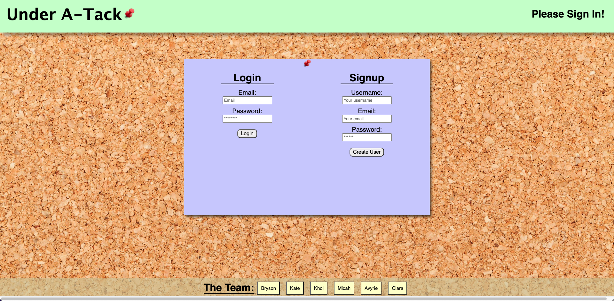
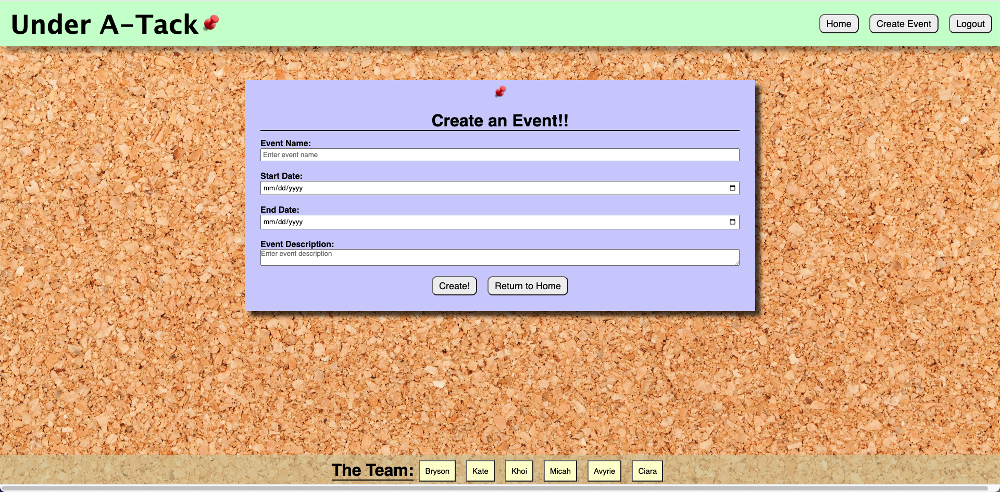
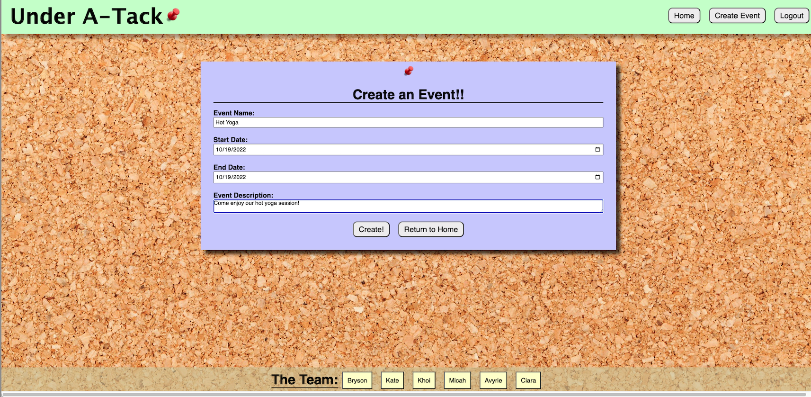
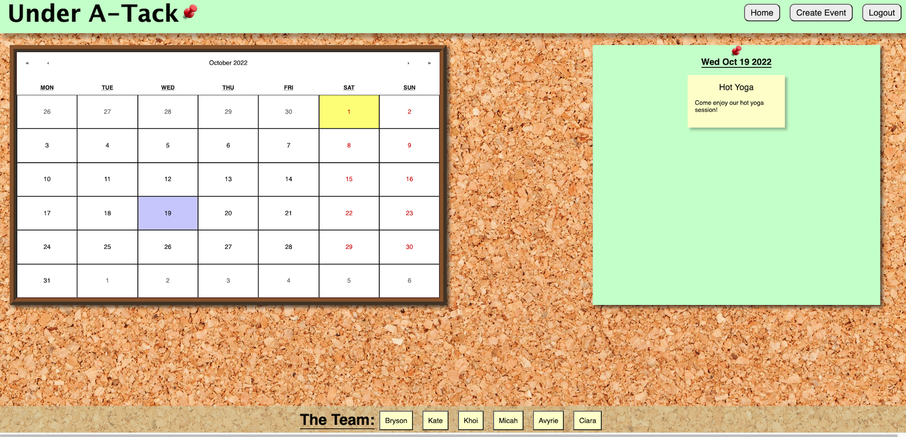

# Project 3 Under a-Tack

## Description

If you find yourself bored and looking for something to do come check out the community board of events happening near you.  

This project uses a React front end and GraphQL server.

## User Story

AS A bored person
I WANT to search a community board
SO THAT I can view events in my area that I can attend

## Table of Contents

- [Installation](#installation)
- [Preview](#preview)
- [Contribution](#contribution)
- [Questions](#questions)

## Installation

To install this project please clone from repo.  Once cloned run `npm i` to install all packages.  Then in the command line in the root folder run `npm run develop`

## Preview

Deployed via [Heroku](https://underatackboard.herokuapp.com/)

This is our landing page when you first enter the app.

Once you login you are taken to the main page where the calendar shows the current date and any events created for that day.

Clicking on the create event button will bring you here to create an event.

An example of how you create the date.

Selecting the date on the calendar you can see the event that was created.

## Contribution

[Avyrie Fellows](https://github.com/Avenix17) 
[Khoi Vu](https://github.com/ChefKhoiRD) 
[Ciara Gauntt](https://github.com/ciaragauntt) 
[Kate Patch](https://github.com/katepatch) 
[Bryson Benson](https://github.com/Firm-Tofu10) 
[Micah Culverhouse](https://github.com/HolyMicah)

## Questions

For questions you can email the authors: 
Avyrie: avyriefellows@gmail.com 
Khoi: kvu6111@gmail.com 
Ciara: ci.gauntt@gmail.com 
Kate: kate.epatch@gmail.com 
Bryson: BrysonNBenson10@gmail.com 
Micah: micahculverhouse1@gmail.com
